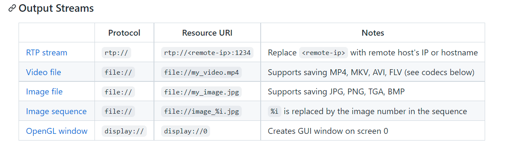

# IEEE Jetson Nano Workshop Pt. 2 - Image Processing and Computer Vision

## Overview
Courtesy of Nvidia, we have 15 Jetsons. We might as well do some image
processing on them.

The Jetsons boast a CUDA-enabled GPU to accelerate computation heavy image
processing workloads. Nvidia provides the VPI library for running specific
prewritten CV algorithms on the backends provided on the jetson. For more
general operations, GPU use is easily facillitated by a library like PyTorch or
Tensorflow, which will emit CUDA instructions for you.

## Image Processing

### Filters
Filters are used in image processing to apply various effects to the image.
Filters are usually represented as vectors and matrices and are applied to an
image via convolution in the time domain or multiplication in the frequency
domain.

Filters usually do not want to change the total amount of energy, so the sum of
absolute values of the elements of the kernel should equal 1. When displaying
kernels, the normalizing factor is usually not included to make it easier to
read.

### Convolution
A convolution between two discrete functions *f* and *g* is defined as


This is essentially dragging a flipped copy of *g* across *f* and multiply and
summing overlapping entries.

For 2D images, convolution can extended for matrices. For every unique
positioning of the kernel over the image, a single entry of the resulting matrix
is created. Because this will result in fewer entries than the original matrix,
the outside of the image is sometimes padded either with zeros or reflections of
the values on the edges of the image.


Convolution in the time domain is the same as multiplication in the frequency
domain, so many filters are designed in the frequency domain and then converted
back into the time domain for easy implementation via matrices.


### Blurring
Blurring is essentially just an averaging of values to make changes in colors
and intensities of pixels less abrupt. This is accomplished per pixel by
averaging all neighboring pixels. For a 1D kernel, this is done with the
following kernel.


This is missing a normalizing constant of 1/3 to make the magnitude of the entries
sum to one.

The 2D version of the kernel would be:


with a normalizing constant of 1/9 not shown here.

To get more blurring, the kernel can be expanded from 3x3 to any larger size
(such as 5x5, 9x9).

The above kernels are called box filters because they look like boxes in the
time domain. However, in the frequency domain, boxes become sinc functions,
which do not attentuate all high frequencies. To fix this, people sometimes use
gaussian filters as low pass filters to blur images.


Gaussians (which are gaussians in the frequency domain as well) attenuate high
frequencies well but does not have a sharp cutoff frequency.


### Edge Detection
Good edge detection should have the following qualities:
1. Good Detection - should be able to find edges and be resilient to noise in
   the image
2. Good localization - edges should be detected near where the actual edge is in
   the original image
3. Minimal Response - each edge should only be detected once

Edges in an image are where large changes in color happen very quickly. A good
way to try and measure this is by taking a gradient (or a first derivative) at a
pixel.


Since an image is in 2D, gradients need to be taken in both the horizontal and
vertical directions. Because we don't care the direction of the gradient and
just the magnitude of the change, we can combine a horizontal and vertical kernel to get the
magnitude of gradient at every pixel. This is usually accomplished using the
Sobel Operator.


Edge detection is incredibly sensitive to noise, so in order to get clear edges,
we need to blur the image by using a box or gaussian filter.

#### Canny Edge Detection
One of many edge detection algorithms is the canny edge detection algorithm.
This algorithm uses a multi-stage algorithm to accurately detect edges in
images.


Steps for Canny Edge Detection:
1. Smoothing - Apply the a LP filter to smooth out the image
2. Gradient Calculation - Find the intensity gradients of the image using a
   kernel of your choice, usually the Sobel operators.
3. Non-Maximal Suppression - Pick a lower bound for gradient intensities that
   will constitute as an edge and make the rest of them 0
4. Double Thresholding - Choose a high and low threshold. Values higher than the
   high threshold are considered strong edges, values inbetween the high and low
   thresholds are considered weak edges, and everything below the low threshold
   is set to 0
5. Hystersis - For every weak edge, check if there is a strong edge pixel around
   it. If so, keep it, else suppress by setting to 0.

By the end of the process, you should have a binary map of edges.

Less precise edge detection methods can be accomplished in many different ways.
One easy way is to simply subtract a blurred version of the image from the
original image, which should leave all high frequencies left. Since edges are
changes that happen fast, edges should be composed of high frequencies.

## VPI

VPI (Vision Programming Interface) is computer vision library that makes the
use of various hardware accelerators very easy

### VPI Backends

A VPI backend is any device VPI can run on, which is one of the following:

#### CPU
Your central processing unit. Even though it does have any particular
graphics-minded accelerations, if all other accelerators are being used, the CPU
can also be used to calculations, just a bit slower.

#### CUDA
The name for any CUDA-enabled GPU. VPI will abstract away any actual CUDA code,
which makes using the GPU much easier.

#### PVA
PVA (Programmable Vision Accelerator) is a specialized processor for image
processing/computer vision. Not in the Jetson though :(

#### VIC
VIC (Video Image Compositor) is a device specialized for low-level image
processing functions (rescaling, color space conversion, etc.). Good for
offloading non-critical tasks from GPU to free GPU for other more calculation
intense operations

### General Use
In python, specifying backends is done mostly with context managers, like as
follows:

```python
with vpi.Backend.CUDA:
	inp = image.convert( vpi.Format.S16 )
	corners, scores = inp.harriscorners( sensitivity=0.01 )
```

Which will run the commands to convert the image format and run the harris
corners algorithm on the native CUDA-enabled GPU. Alternatively, you can specify
which backend to use for a specific command by doing:

```python
out = inp.convert( vpi.Format.BGR8, backend=vpi.Backend.CUDA )
```

VPI provides easy to use code for a small sample of vision algorithms, such as
LP filters like the box and gaussian filters, the FFT, morphological operations
such as erode and dilate, and a general convolution algorithm. Some more
involved algorithms provided are lens distortion correction, color equalization
histograms, and background subtractors. Each algorithm has been written to run
on a subset of available backends--a list of algorithms and the backends they
run on can be found [here](docs.nvidia.com/vpi/algorithms/html)

Python simplifies a lot of the synchronization and parallelism that is inherent
in using multiple backends. If you have done some parallel processing in
something like MPI or are generally interested in running many different streams
at once, consider looking into the C++ API for greater control of algorithm
scheduling. Unfortunately, the Python API is practically non-existent and the
examples are written in VPI 2.0 while the jetsons currently have version 1, so
some hacking may be required to get everything to work as intended. The C++ API
can be found [here](docs.nvidia.com/vpi/usergroup0.html)

## Using the GPU
VPI only offers a limited amount of quick, GPU supported algorithms. What if you
want to do something that VPI does not offer? You can decide to write your own
CUDA code, which is terrible, or you could decide to build the GPU enabled
version of openCV for the jetson, which is annoying, or you can just manually
write all the code for your algorithms in a framework like pyTorch or
Tensorflow, which will convert your code into CUDA for you.

### GPUs in PyTorch
For all PyTorch tensors/layers/model, you can specify on which device to place
it on. In the case of using a CUDA-enabled GPU, you can set the device to "cuda"
in order to place a tensor/layer/model on the GPU.

```python
import torch

cuda = torch.device( 'cuda' )

x = torch.ones( [5, 2], device=cuda )
```

The above code creates the device *cuda* to hold the GPU we are going to be
using and then *cuda* can be passed in wherever there is a device parameter to
tell torch to use the GPU.

Additionally, you can make torch use the GPU by using a context manager.

```python
with torch.cuda.device(0):
	# code here
```

This context manager tells torch to use the 0th, or first, GPU available. The
jetson nano only has a single GPU, so always pass 0 here.

PyTorch provides functions for adding, subtracting, multiplying, convoluting,
and many other useful mathematical functions with GPU support. Torch tensors can
be transfered to VPI arrays and images and vice versa, so the two libraries can
be run in collaboration. Unlike VPI (or openCV), torch does not have pre-written
computer vision code--you will have to write these yourself. But torch will take
care of the GPU and CUDA for you

## Cameras

We will be using MIPI CSI cameras during the workshop. In general, the jetson
nanos can take input streams from many different places and output to many
different places. 

### Getting Camera Input
Since we have a single camera port and are using CSI cameras, cameras should be
located at *csi://0*. Frames can be accessed via the following python code:

```python
import sys
import jetson.utils

camera = jetson.utils.videoSource( "csi://0", argv=sys.argv )
image = camera.Capture()

# do something with image
```

To capture and save images without having to run code, you can run the
nvgstcapture-1.0 command and press j-[Enter] to capture a single image, then
q-[Enter] to exit the program. Though if running headless, it may be hard to run

### Streaming Output
Output can either be sent out as a stream, displayed either on the display
attached the jetson or on a remote screen through UDP, or saved in a video file.
This can be specified by passing a URI when creating a videoOutput object.

The following options are available:



To run code while output is streaming, use the following code:

```python
import sys
import jetson.utils

display = jetson.utils.videoOutput( "display://0", argv=sys.argv )

while display.IsStreaming():
	# some code here

	display.Render( image )
        display.SetStatus( "{:s} | {:d}x{:d} | {:.1f} FPS".format( "Harris Camera Viewer", image.width, image.height, display.GetFrameRate() ) )
```

#### For the Workshop ...
For this workshop, we are running headless through micro USB, which makes it
hard to launch a second window to stream output. Therefore, we are using the
python framework Flask to create a local website to stream the video to,
allowing us to view it on our laptops

```python3
from flask import Response, Flask
import numpy as np
import cv2
import jetson.utils
import sys

camera = jetson.utils.videoSource( "csi://0", argv=sys.argv )

app = Flask( __name__ )

def get_image():
    image = camera.Capture()
    image = jetson.utils.cudaToNumpy( image ) 
    return image

def encode_video():
    while True:
        image = get_image()
        return_key, encoded = cv2.imencode( ".jpg", image )
        yield(b'--frame\r\n' b'Content-Type: image/jpeg\r\n\r\n' +  encoded.tobytes()  + b'\r\n\r\n' )

@app.route( "/" )
def streamFrames():
    return Response( encode_video(), mimetype="multipart/x-mixed-replace; boundary=frame" )

if __name__ == "__main__":
    app.run( "0.0.0.0", port="8000" )
```    

## Resources
[Jetson Hello AI World](https://github.com/dusty-nv/jetson-inference)
[Flask Video Streaming](https://towardsdatascience.com/how-to-display-video-streaming-from-a-webcam-using-flask-7a15e26fbab8)
[Convolution](https://www.dspguide.com/ch6.htm)
[VPI Tutorials](https://docs.nvidia.com/vpi/tutorial.html)
[Canny Edge Detection](https://en.wikipedia.org/wiki/Canny_edge_detector)
