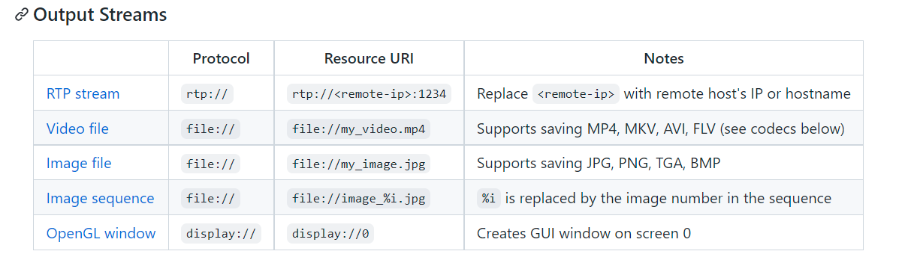

## Cameras

We will be using MIPI CSI cameras during the workshop. In general, the jetson
nanos can take input streams from many different places and output to many
different places. 

### Getting Camera Input
Since we have a single camera port and are using CSI cameras, cameras should be
located at *csi://0*. Frames can be accessed via the following python code:

```python
import sys
import jetson.utils

camera = jetson.utils.videoSource( "csi://0", argv=sys.argv )
image = camera.Capture()

# do something with image
```

To capture and save images without having to run code, you can run the
nvgstcapture-1.0 command and press j-[Enter] to capture a single image, then
q-[Enter] to exit the program. Though if running headless, it may be hard to run

### Streaming Output
Output can either be sent out as a stream, displayed either on the display
attached the jetson or on a remote screen through UDP, or saved in a video file.
This can be specified by passing a URI when creating a videoOutput object.

The following options are available:



To run code while output is streaming, use the following code:

```python
import sys
import jetson.utils

display = jetson.utils.videoOutput( "display://0", argv=sys.argv )

while display.IsStreaming():
	# some code here

	display.Render( image )
        display.SetStatus( "{:s} | {:d}x{:d} | {:.1f} FPS".format( "Harris Camera Viewer", image.width, image.height, display.GetFrameRate() ) )
```
