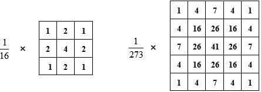
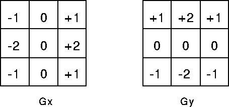

## Image Processing

### Filters
Filters are used in image processing to apply various effects to the image.
Filters are usually represented as vectors and matrices and are applied to an
image via convolution in the time domain or multiplication in the frequency
domain.

Filters usually do not want to change the total amount of energy, so the sum of
absolute values of the elements of the kernel should equal 1. When displaying
kernels, the normalizing factor is usually not included to make it easier to
read.

### Convolution
A convolution between two discrete functions *f* and *g* is defined as

This is essentially dragging a flipped copy of *g* across *f* and multiply and
summing overlapping entries.

For 2D images, convolution can extended for matrices. For every unique
positioning of the kernel over the image, a single entry of the resulting matrix
is created. Because this will result in fewer entries than the original matrix,
the outside of the image is sometimes padded either with zeros or reflections of
the values on the edges of the image.

Convolution in the time domain is the same as multiplication in the frequency
domain, so many filters are designed in the frequency domain and then converted
back into the time domain for easy implementation via matrices.

### Blurring
Blurring is essentially just an averaging of values to make changes in colors
and intensities of pixels less abrupt. This is accomplished per pixel by
averaging all neighboring pixels. For a 1D kernel, this is done with the
following kernel.

This is missing a normalizing constant of 1/3 to make the magnitude of the entries
sum to one.

The 2D version of the kernel would be:

with a normalizing constant of 1/9 not shown here.

To get more blurring, the kernel can be expanded from 3x3 to any larger size
(such as 5x5, 9x9).

The above kernels are called box filters because they look like boxes in the
time domain. However, in the frequency domain, boxes become sinc functions,
which do not attentuate all high frequencies. To fix this, people sometimes use
gaussian filters as low pass filters to blur images.

Gaussians (which are gaussians in the frequency domain as well) attenuate high
frequencies well but does not have a sharp cutoff frequency.

### Edge Detection
Good edge detection should have the following qualities:
1. Good Detection - should be able to find edges and be resilient to noise in
   the image
2. Good localization - edges should be detected near where the actual edge is in
   the original image
3. Minimal Response - each edge should only be detected once

Edges in an image are where large changes in color happen very quickly. A good
way to try and measure this is by taking a gradient (or a first derivative) at a
pixel.

Since an image is in 2D, gradients need to be taken in both the horizontal and
vertical directions. Because we don't care the direction of the gradient and
just the magnitude of the change, we can combine a horizontal and vertical kernel to get the
magnitude of gradient at every pixel. This is usually accomplished using the
Sobel Operator.

Edge detection is incredibly sensitive to noise, so in order to get clear edges,
we need to blur the image by using a box or gaussian filter.

#### Canny Edge Detection
One of many edge detection algorithms is the canny edge detection algorithm.
This algorithm uses a multi-stage algorithm to accurately detect edges in
images.

Steps for Canny Edge Detection:
1. Smoothing - Apply the a LP filter to smooth out the image
2. Gradient Calculation - Find the intensity gradients of the image using a
   kernel of your choice, usually the Sobel operators.
3. Non-Maximal Suppression - Pick a lower bound for gradient intensities that
   will constitute as an edge and make the rest of them 0
4. Double Thresholding - Choose a high and low threshold. Values higher than the
   high threshold are considered strong edges, values inbetween the high and low
   thresholds are considered weak edges, and everything below the low threshold
   is set to 0
5. Hystersis - For every weak edge, check if there is a strong edge pixel around
   it. If so, keep it, else suppress by setting to 0.

By the end of the process, you should have a binary map of edges.

Less precise edge detection methods can be accomplished in many different ways.
One easy way is to simply subtract a blurred version of the image from the
original image, which should leave all high frequencies left. Since edges are
changes that happen fast, edges should be composed of high frequencies.
